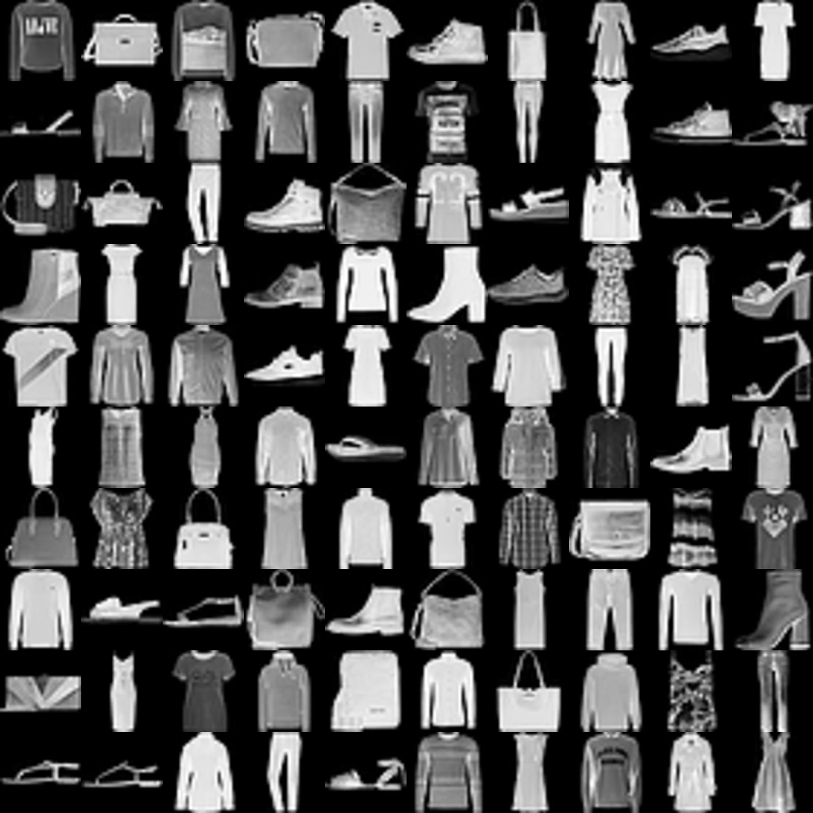
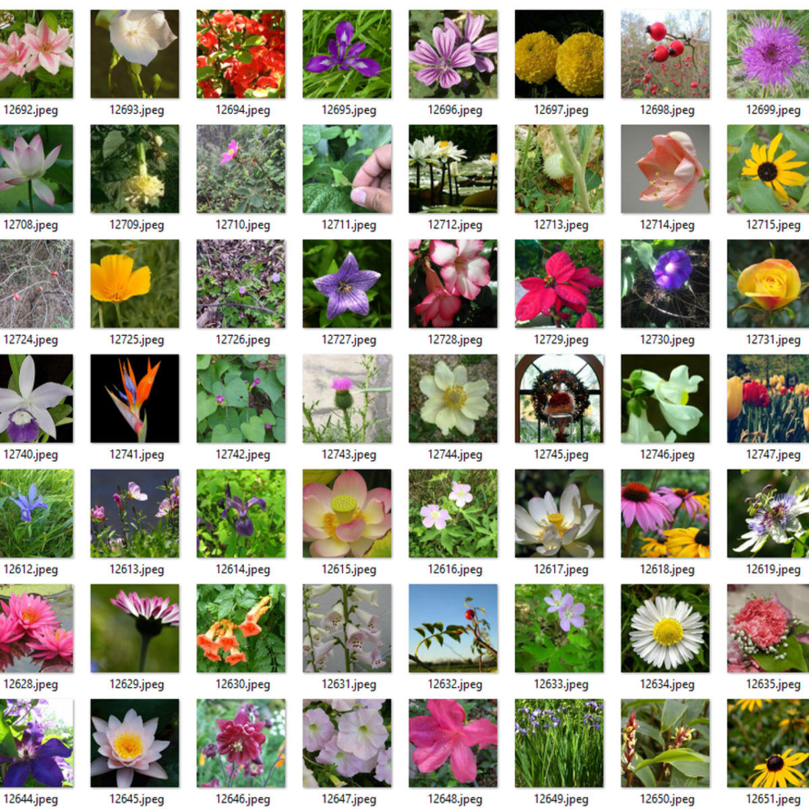
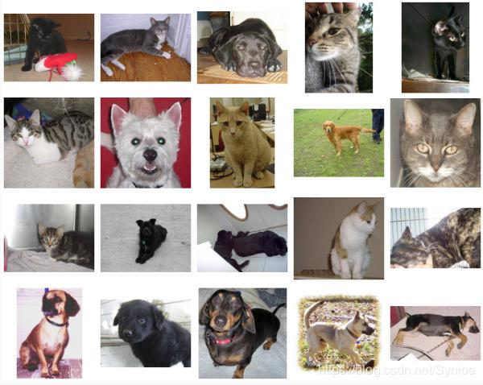

## Simple Classification Models in Tensorflow 2:
This repository contains simple classification models written in Tensorflow 2.

### Requirement
```
numpy==1.18.1
python==3.7.0
tensorflow==2.0
```

### How to use
Training & Prediction can be run as follows:    
`python model_1.py train`  
`python model_1.py predict img.png`

### Models:
* You can use model_1.py for classifying MNIST Dataset.  
  The dataset can be downloaded from [here](http://yann.lecun.com/exdb/mnist/)   
 Please notice that you need to extract the images first.

 

* You can use model_2.py for classifying CIFAR10 dataset.  
 The dataset can be downloaded from [here](https://www.kaggle.com/c/cifar-10)   

 

* You can use model_3.py for classifying fashion_minist dataset.  
 The dataset can be downloaded from [here](https://www.kaggle.com/zalando-research/fashionmnist)   

 

* You can use model_4.py for classifying flowers dataset.  
 The dataset can be downloaded from [here](https://www.kaggle.com/alxmamaev/flowers-recognition)   

 

* You can use model_5.py for classifying cat_dog dataset.  
 The dataset can be downloaded from [here]( https://www.kaggle.com/tongpython/cat-and-dog?)

 
